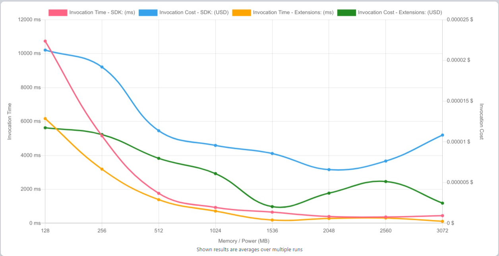

# Secrets Management in .NET Lambda: AWS SDK vs. Lambda Extension

This repository contains the source code of 2 .NET 8 Lambda Functions developed using ASP.NET Core Minimal API that demonstrate how to manage secrets in AWS Lambda. 
The first function uses the AWS SDK to retrieve secrets from AWS Secrets Manager, while the second function uses the Lambda Extension for Secrets Manager 
to retrieve secrets.

### LambdaWithSecretAWSSDK ##

This folder contains the source code of a .NET 8 Lambda Function - (Lambda.Secrets.AWSSDK.sln) developed using ASP.NET Core Minimal API 
that demonstrates how to manage secrets in AWS Lambda using the AWS SDK.

### LambdaWithSecretManagerExtension ###

This folder contains the source code of a .NET 8 Lambda Function - Lambda.Secrets.Extension.sln) developed using ASP.NET Core Minimal API that demonstrates how 
to manage secrets in AWS Lambda using the Lambda Extension for Secrets Manager.

## Test : AWS Lambda Power Tuning ###
AWS Lambda Power Tuning (https://github.com/alexcasalboni/aws-lambda-power-tuning) was used to test the performance of the Lambda functions.
The tool was used to test the Lambda functions with the following memory configurations: 128 MB, 256 MB, 512 MB, 1024 MB, 2048 MB, 2560 MB,3072 MB. 
Lambda invocations were done in parallel and had a  combination of cold starts and warm starts. The tool measured  execution time and calculated the
associated costs, providing insights into performance improvements.

## Test Results ###
